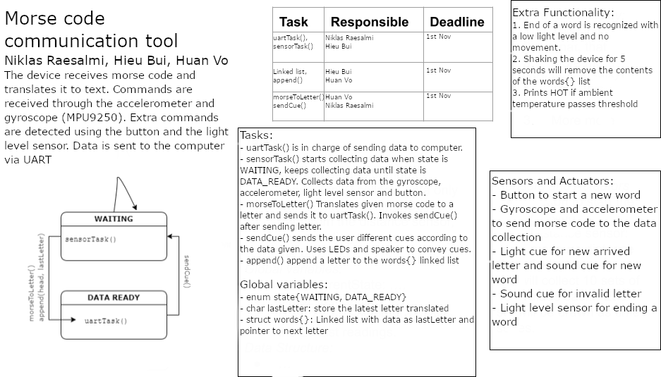

# Computer Systems Final Project: Morse Code Receiver and Transmitter

This project was developed as part of the **Computer Systems** course. The goal was to create a system that sends and receives Morse code messages using the TI SensorTag cc2650 using UART communication, with additional functionality for SOS signaling through sound and light cues.

### **Project Plan**

### **Features**
- **Morse Code Sending via Device Motion**:
  - Rotate the device to the left for a dot (`.`), to the right for a dash (`-`), and up or down for a space (` `).
- **SOS Button**:
  - Quickly send the SOS Morse code message (`... --- ...`) with the press of a button.
  - Triggers a **'Star Wars' theme song** when the SOS button is pressed for distraction.
  - **Light Blinking**: The light pattern matches the SOS message when button is pressed.
- **Data sending and receiving via UART**:
  - The system can receive text in Morse code format via UART and use a buzzer to play the received message with long and short beeps.
    - Short beep (`.`) for dot.
    - Long beep (`-`) for dash.
    - Short pause for new letter
    - Long pause for new word
- **MPU Sensor Integration**:
  - Gather **gyroscope** and **accelerometer** data to detect device motion for Morse code entry.
- **State Machine**:
  - A state machine was used to handle running tasks concurrently and to ensure smooth operation of various components with varying priorities.

### **Technologies Used**
- **Hardware**:
  - MPU sensor (for gyroscope and accelerometer data).
  - Buzzer and light for output feedback.
  - UART for communication.
- **Software**:
  - Implemented using embedded C for low-level control of hardware.
  - State machine for managing tasks.
- **Communication**:
  - UART for receiving and sending Morse code input.
  - Buzzer for audio feedback.

### **Challenges and Solutions**
- **Morse Code Detection**:
  - The biggest challenge was efficiently mapping device rotations to the Morse code inputs while maintaining accuracy. This was handled by observing values produced by  testing the device's orientations.
- **Concurrent Task Handling**:
  - Using a state machine allowed us to handle multiple tasks simultaneously, like detecting device movement, processing button presses, and playing sounds.

## Project demo:

---

## **Contributors**
- **Niklas Raesalmi**: Designed and implemented the SOS button and light blinking functionality.
- **Hieu Bui**: Worked on detecting device motion using the MPU sensor for Morse code input.
- **Huan Vo**: Integrated the UART communication and 'Star Wars' theme sound effect.

---

## **Future Improvements**
- Expand the system to handle longer Morse code messages and more complex commands.
- Improve the light and sound feedback for better user interaction.
- Use more sensors to improve input accuracy and add more interactive features.
